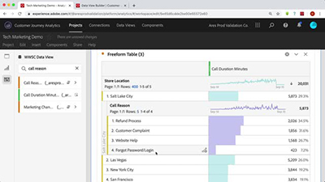

# Tutoriais do Customer Journey Analytics

Bem-vindo ao Site de tutoriais do [!DNL Customer Journey Analytics].  A utilização desses tutoriais juntamente com a [documentação](https://experienceleague.adobe.com/docs/analytics-platform/using/cja-landing.html?lang=pt-BR) oferece um melhor entendimento de como usar o Adobe Analytics para obter insights do cliente em vários canais ainda mais rápido.  Para começar,

* Consulte a seção **“Novidades”** abaixo para obter os utilitários mais recentes
* **As escolhas da equipe** destacam alguns de nossos conteúdos favoritos
* Explore o conteúdo por tópico e subtópico na **navegação à esquerda**
* Use o campo de **pesquisa** na parte superior da página se você souber o que está procurando

O Customer Journey Analytics permite controlar como você conecta os dados online e offline na Analysis Workspace em qualquer ID de cliente comum, permitindo, finalmente, fazer atribuição, segmentação, fluxo, fallout etc. em todo o conjunto de dados do cliente.

## Escolhas da equipe

<table>
<tr>
  <td>
    
    

      <a href="visitor-id/understanding-how-customer-journey-analytics-uses-identity.md">
    <strong>Entendendo Como O Customer Journey Analytics Usa A Identidade</strong>
    </a>
    

    

    <em>Uma visão prática de como a identidade afeta sua análise no Customer Journey Analytics</em>
    

  </td>
   <td>
    
    

      <a href="architecture/architecture-and-integrations-of-cja.md">
    <strong>Arquitetura e integrações do Customer Journey Analytics</strong>
    </a>
    

    

    <em>Apresentação da arquitetura do Customer Journey Analytics, incluindo a integração com a Adobe Experience Platform.</em>
    

  </td>
  <td>
    
    

      <a href="analysis-workspace/visualizations/cross-channel-attribution-in-customer-journey-analytics.md">
    <strong>Atribuição entre canais no Customer Journey Analytics</strong>
    </a>
    

    

    <em>Saiba como usar as visualizações para mostrar atribuição (dar crédito) entre canais.</em>
    

  </td>
</tr>
</table>

